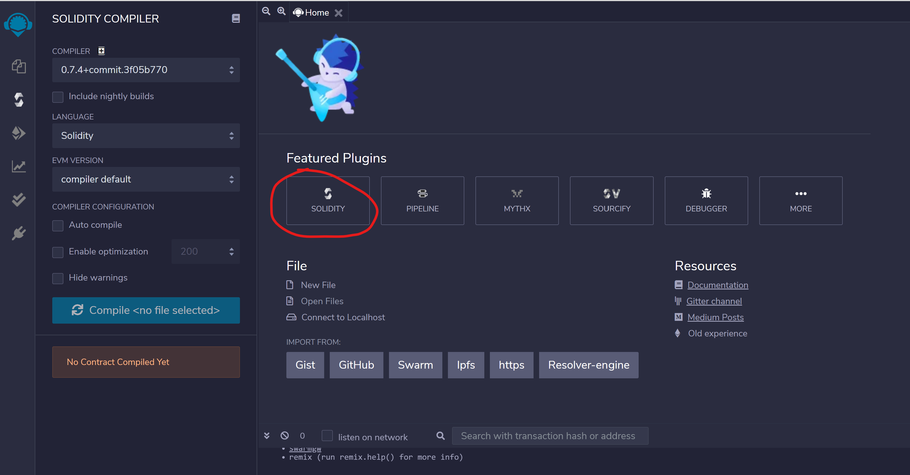
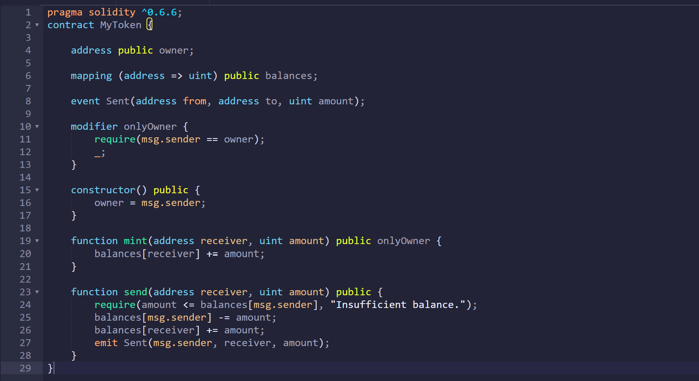

# FinTech Lesson Plan: Smart Contracts in Solidity

---

## Overview

This class will introduce the students to Solidity programming language.

Solidity is a object-oriented programming language used to write smart contracts. It is compatible with many blockchain platforms such as Ethereum.

The goal of the lesson is to help students familiarize with the various features of Solidity. Students then will write a basic smart contract involving a real estate transation with escrow with Solidity.

## Class Objectives

By the end of the class, students will be able to:

* Understand the basic structure of Solidity programming language.
  
* Write and deploy a Solidity smart contract in Remix IDE.

* Learn how to make a smart contract more efficient and less costly.


## Welcome

Welcome to the class! Today we will learn about Solidity, a programming language used to write smart contracts.

Brief overview about smart contracts:

* Smart contracts are a computer program used to establish the terms of an agreement.

* It can be used to run transactions without the need of a third-party mediator or a central authority.

* Smart contracts can be written using various languages, including C++, Java or Javascript. In this class we will use Solidity, which is specifically developed to write a smart contract for various Blockchain platforms such as Ethereum.

* Decentralized Applications, or `dApps`, are applications that run on distributed computing system. Smart contracts constitute a backend for `dApps`.

* MetaMask is a web browser extension enabling a user to run a `dApp` on a browser.

* Ganache, a part of Truffle suite, is used to develop Blockchain easily.

* Five pillars of blockchains are:

  * Open
    
  * Borderless

  * Neutral

  * Censorship-resistant
  
  * Public

## Introducing Solidity

Solidity is a programming language used to write smart contracts for blockchain platforms such as Ethereum.

* Why use Solidity for writing smart contracts?

  * Solidity is designed specifically for developing smart contracts and is compatible with many blockchain platforms, including Ethereum. Ethereum is the most popular blockchain platform to develop `dApps` and it is compatible with many tools, including MetaMask, Truffle and Remix.

* Solidity vs other programming languages:

  * Solidity, like other languages such as C, has variables, functions, classes, operations and string manipulation.

  * Classes in Solidity are called `contract`s.

  * Solidity uses strict typing, unlike python.

    * This is to prevent ambiguity in a contract and to reduce computational complexity (i.e. save on gas).

* Data types of Solidity:

  * Boolean - True or False

  * Integer - both signed (`int`) and unsigned integers (`uint`)

  * String - either single or double quotes

  * Modifier - to ensure the logicality of any condition before executing the code
  
  * Array - both single and multidimensional arrays
  
    * `type var[size]` - fixed size array
  
    * `type[] var` - dynamic size array

  * Mapping - equivalent to dictionary in python

    * `mapping (keytype => valuetype) map`

* What is Remix?

  * Remix is an IDE and compiler for Solidty language. It allows you to deploy your Solidity smart contracts to Ethereum.

## Writing first smart contract in Remix

Click on [this link to open Remix IDE](http://remix.ethereum.org).

In "Featured Plugins" menu, click on "Solidity" to go into Solidity environment: 

 

Go into File Explorer and click on the new file button:

 

Name your new file as `myToken.sol` and click on "OK":

 

First, we set the Solidity version to 0.6.6 - `pragma solidity ^0.6.6;`. As Solidity gets updated fairly often with significant changes, it is important to specify the right version.

Then we create our first `contract` with following variables:

* `address public owner` : Address of the contract owner. Variable type `address` allows you to store an Ethereum address more efficiently.

* `mapping (address => uint) public balances` : The `mapping` is a key-value pair of a user address and token balance for each user.

In the editor type the following:

```solidity
pragma solidity ^0.6.6;
contract MyToken {
   address public owner;
   mapping (address => uint) public balances;
}
```

## Functions in Solidity

We will create the constructor for our contract. It is a function to initialize state variables of the contract. For our contract we will create a constructor to set `owner` as contract creator (`msg.sender`).

Inside the contract (i.e. before "`}`") type the following:
```solidity
  constructor() public {
    owner = msg.sender;
  }
```

Then we will create a function to mint new tokens:

```solidity
  function mint(address receiver, uint amount) public {
    balances[receiver] += amount;
  }
```

We will also create a function to send tokens. We will `require` the user to have enough amount in their balance to be able to send the tokens:

```solidity
  function send(address receiver, uint amount) public {
    require(amount <= balances[msg.sender], "Insufficient balance.");
    balances[msg.sender] -= amount;
    balances[receiver] += amount;
  }
```

The code should look like this:

 

## Events and modifiers in Solidity

Events are used to log certain transactions in a blockchain. In our token contract, we will create one to track all `send` transactions.

Add this line before the constructor to create an event:

```solidity
event Sent(address from, address to, uint amount);
```

and this inside `send` function to `emit` the event whenever tokens are being sent:
```solidity
emit Sent(msg.sender, receiver, amount);
```

Modifiers are used to modify the behaviour of a function.

Add this modifier before the constructor:
```solidity
  modifier onlyOwner {
    require(msg.sender == owner);
    _;
  }
```

`_;` is where the function body (i.e. the function being modified) goes in. In this case the function will only execute if `msg.sender == owner`.

Then modify the `mint` function:

```solidity
  function mint(address receiver, uint amount) public onlyOwner {
    balances[receiver] += amount;
  }
```

As we do not want anyone to be able to mint the token we will `require` the user to be the `owner` to mint new tokens.

The code should look like this:

 

## Compiling and deploying the smart contract

Once you are done writing the code, compile the code by clicking on "Solidity compiler" menu and click "Compile myToken.sol":

 

Go to "Deploy & run transactions" menu and select Injected Web3 as Environment. MetaMask should pop up:

 

Click on Deploy. Confirm the transation on MetaMask window:

 

In "Deployed Contracts" at the bottom of the menu you can find the contract we just deployed. You can run `mint` and `send` functions. You can also check the `balances` of each account:

 

## Sending Ether via smart contract

Let's create a new contract named `bank.sol`.

In this contract we intruduce a new keyword : `payable`

* `payable` functions are the ones where you can send ethers to the contract using them.

* `address payable` addresses are the ones you can send ethers to.

Type this in the new file:

```solidity
pragma solidity ^0.6.6;
contract Bank {

  constructor() public payable {}

  function withdraw(uint amount, address payable recipient) public {
    return recipient.transfer(amount);
  }

  function deposit() public payable {}

  fallback() external payable {}
}
```
`constructor() public payable {}` is an empty `payable` constructor. It enables you to put some ethers when you deploy the contract. The function is empty as `payable` modifier enables the function to accept ether sent to this function and deposit it to the contract.

`withdraw` function is used to take ether from the bank contract to the `recipient`. It uses `recipient.transfer(amount)` function to transfer `amount` wei (10^-18 ethers) to `recipient`.

`deposit` function is used to deposit ether to the bank contract. The function is empty for the same reason as constructor.

`receive() external payable {}` is a fallback function that is only able to receive ether. It is called when a non-existent function is called on the contract. It allows any ether sent to this contract to be accepted. `external` keyword is for functions that can be called externally only (unlike `public` that can be called both internally and externally). It is more efficient to use `external` as it does not require memory allocation (again, less gas!).

Deploy the contract. Here we will try deploying the contract with a half an ether (5 * 10^17 wei):

  

We can deposit some more ether via `deposit` function. Make sure you put the amount you want to deposit in "Value."

  

We can try withdrawing some ether to another account. Here we are withdrawing a half an ether (5 * 10^17 wei). Make sure you put the amount in wei!

  

You will see this error if there is insufficient balance in the contract:

  

## Activity - Estate planning with a smart contract will

In this exercise, students will be implementing a smart contract that implements a *will*. A *will* is a legal document that says how you want your estate to be divided once you die.

The contract will have the owner deposit the estate upon deployment. The owner than can add the beneficiaries (i.e. someone who'll inherit from the estate) with inheritance to be given for each beneficiary. Only the owner can add the beneficiaries.

Once the testator (i.e. the person who wrote the *will*) dies the inheritance will be paid to the beneficiaries.

**Instructions:**

Open [Remix](http://remix.ethereum.org) and import the [Starter Code](Activities/Unsolved/will.sol) by clicking on "Add local file" button:

  

The smart contract will contains following State Variables (i.e. variables that are stored in the contract permanently):

* `address owner` : owner of the contract

* `uint estate` : amount of the estate left

* `uint totalInheritance` : total amount of inheritance to be sent to the beneficiaries
  
* `bool isDeceased` : true if the testator is deceased
  
* `address payable[] beneficiaries` : payable addresses of beneficiaries
  
* `mapping (address => uint) inheritance` : inheritance value per each beneficiary

and following events:

* `event BeneficiaryAdded(address beneficiary, uint amount)` : to be emitted when a new beneficiary is added to the will
    
* `event Paid()` : to be emitted when inheritance is paid to the beneficiaries from the estate

Start by implementing the constructor. It should do the following actions:

* Set `owner` as `msg.sender` - it is the address which have deployed the contract.

* set `estate` as `msg.value` - it is the value of ethers that were passed to the contract.

* Set `totalInheritance` to `0`.

* Set `isDeceased` as `false`.
  
Then implement the following modifiers:

* `onlyOwner` : `require` that the message sender is the owner.

* `onlyIfDeceased` : `require` that `isDeceased` is true.

* `onlyIfAlive` : `require` that `isDeceased` is false.

For the modifiers, leave the underscore `_` at the end of the function. This is to allow the calling function to be executed once they pass `require`.

Implement `addNewBeneficiary` function. It has the address of the `beneficiary` and the `amount` to be inherited as parameters. It will only run if the owner is the message sender. It should do the following actions:

* `require` that there will be sufficient amount to pay out in the estate.

  * How much do we need to pay the `beneficiary` passed and the other `beneficiaries`? Remember that the other `beneficiaries` will recieve .`totalInheritance` wei.

* Add the `beneficiary` to the `beneficiaries` array. You can use `array.push(item)` to add an `item` to an `array`.

* Set `inheritance` for the `beneficiary` as `amount`. You can set a dictionary value by `dictionary[key] = value`.

* Add the `amount` to `totalInheritance`

* Emit `BeneficiaryAdded` event with `beneficiary` and `amount` as parameters.

Implement `payout` function. It will only run if the testator is deceased. It should do the following actions:

* For each `beneficiary` in `beneficiaries` array pay their `inheritance` amount.

  * You can use `for` loop to do this. For loop has following structure : `for (initialization; test condition; iteration)`.

    * You can initialize a counter for `initialization` (ex. `uint i = 0`). It runs before the loop begins.

    * the loop will continue until `test condition` is false. So it can be something like `i < x`.

    * `iteration` will run after each iteration. You can try incrementing or decrementing the counter.

    * Example : `for (uint i = 0; i < x; i++)` will loop x number of times until `i` is `x`.
  
  * **HINT** : you can get the number of beneficiaries by `beneficiaries.length`. Try looping `beneficiaries.length` times.

    * You can also use counter variable (i.e. `i`) to retrieve each beneficiaries. Use `beneficiaries[i]`.

  * Use `address.transfer(amount)` to transfer `amount` wei to `address`.

* Emit `Paid` event.

Implement `deceased` function. It will only run if the owner is the message sender and `isDeceased` is false. It should do the following actions:

* Set `isDeceased` to `true`.

* Call `payout` function.

**Files:**

* [Unsolved - will.sol](Activities/Unsolved/will.sol)

* [Solved - will.sol](Activities/Solved/will.sol)

## Review Activity

Open [Remix](http://remix.ethereum.org) and import the [Solution](Activities/Solved/will.sol).

Deploy the contract and try adding Ethreum addresses to beneficiaries.

Adding a beneficiary with a half ether of inheritance:

  

Click on `deceased` once you are done adding beneficiaries:

  

Check whether the beneficiaries received the inheritance. In this case two beneficiaries were added with a half ether of inheritance each.

BEFORE:

  

AFTER:

  

### Questions and Answers

* Why does `deceased` function have `onlyIfAlive` modifier?

  * **Answer:** It is to prevent the inheritance from being paid out multiple times.

* What happens if `totalInheritance` is less than `estate`?

  * **Answer:** The remaining ether will be stuck in the contract.
  
* what can we do to make sure the remaining ether can be retrieved?

  * **Answer:** We can add a withdrawal function. It will go like this:
  ```solidity
  function withdraw() onlyOwner{ // make sure only the owner can withdraw the remaining balance
    msg.sender.transfer(this.balance);
  }
  ```
  